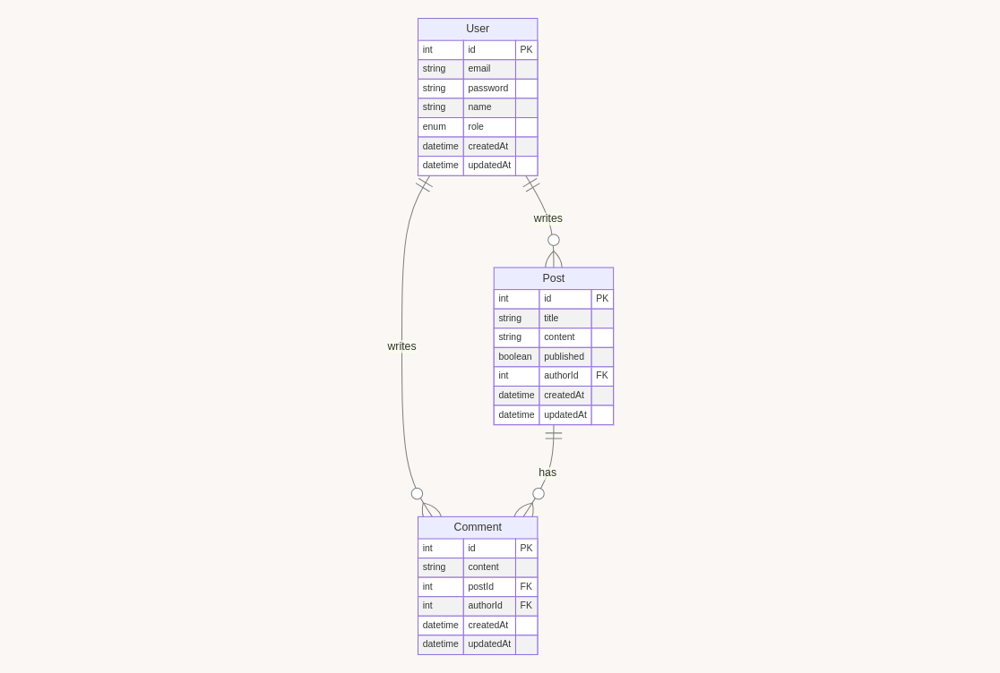

# 🚀 Full-Stack Blog System

A modern, scalable blog system with a REST API backend and two separate frontend applications. This project demonstrates proficiency in full-stack development, API design, and authentication implementation.


## 🌟 Features

- **RESTful API**: Built with Express.js and Prisma ORM
- **Authentication**: Secure JWT-based authentication system
- **Dual Frontend**: 
  - Public blog for readers
  - Admin dashboard for content management
- **Database**: PostgreSQL for robust data storage
- **Rich Text Editing**: Integrated TinyMCE for a superior writing experience
- **Responsive Design**: Mobile-friendly interfaces for both frontends

## 🛠️ Technologies Used

### Backend
- Node.js
- Express.js
- Prisma ORM
- PostgreSQL
- JSON Web Tokens (JWT)

### Frontend
- React.js
- React Router
- Axios
- TinyMCE

### DevOps
- Docker
- GitHub Actions (CI/CD)

## 📐 Architecture

This project follows a microservices architecture:

1. **API Server**: Handles all database operations and serves data to both frontends
2. **Public Blog Frontend**: Displays published posts and allows comments
3. **Admin Dashboard**: Provides full CRUD functionality for posts and user management

## 📊 Database Schema

The following Entity-Relationship Diagram (ERD) represents the database structure of our blog system:



This diagram illustrates the relationships between the main entities in our system:

- **User**: Represents both blog authors and commenters. Each user can write multiple posts and comments.
- **Post**: Represents blog posts. Each post is written by one user (author) and can have multiple comments.
- **Comment**: Represents comments on blog posts. Each comment is associated with one post and one user (commenter).

The use of foreign keys (FK) ensures referential integrity in our database, while the inclusion of `createdAt` and `updatedAt` fields allows for efficient tracking of data changes over time.

## 🚀 Getting Started

### Prerequisites
- Node.js (v14+)
- PostgreSQL
- Docker (optional)

### Installation

1. Clone the repository
   ```
   git clone https://github.com/your-username/full-stack-blog-system.git
   ```

2. Install dependencies
   ```
   cd full-stack-blog-system
   npm install
   ```

3. Set up environment variables
   ```
   cp .env.example .env
   ```
   Edit the `.env` file with your database credentials and JWT secret

4. Run database migrations
   ```
   npx prisma migrate dev
   ```

5. Start the development server
   ```
   npm run dev
   ```

Visit `http://localhost:3000` for the public blog and `http://localhost:3001` for the admin dashboard.

## 🧪 Testing

Run the test suite with:

```
npm test
```

## 📚 API Documentation

API documentation is available at `/api-docs` when running the server.

## 🔐 Security

- JWT authentication for protected routes
- Passwords hashed using bcrypt
- CORS configured for frontend origins
- Rate limiting on API endpoints

## 🚢 Deployment

This project is set up for easy deployment to cloud platforms:

- Backend: Heroku
- Frontend: Netlify
- Database: Heroku Postgres

Detailed deployment instructions are available in `DEPLOYMENT.md`.

## 🛣️ Roadmap

- [ ] Implement real-time comments with WebSockets
- [ ] Add social media sharing functionality
- [ ] Integrate an email newsletter system

## 🤝 Contributing

Contributions are welcome! Please read the `CONTRIBUTING.md` for details on our code of conduct and the process for submitting pull requests.

## 📜 License